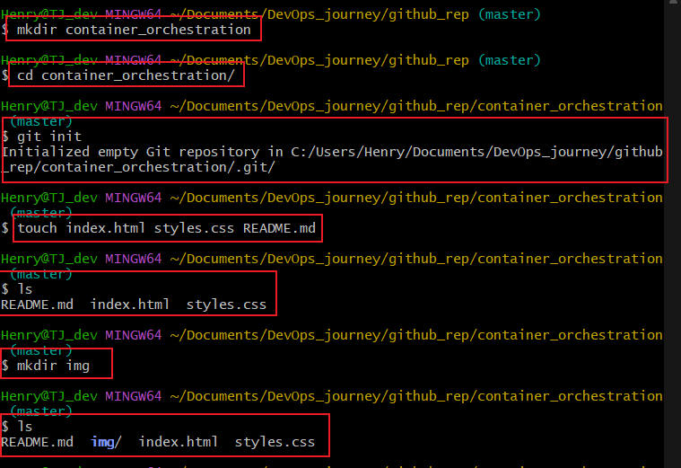
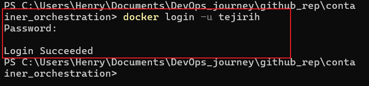
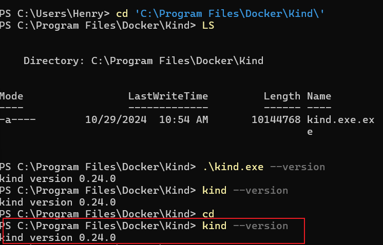
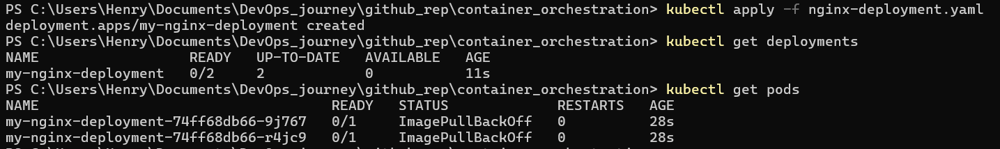
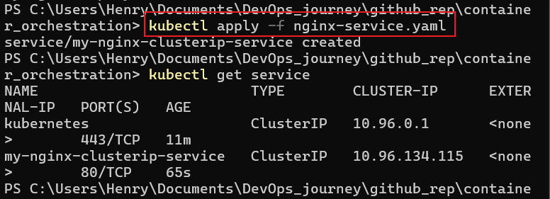
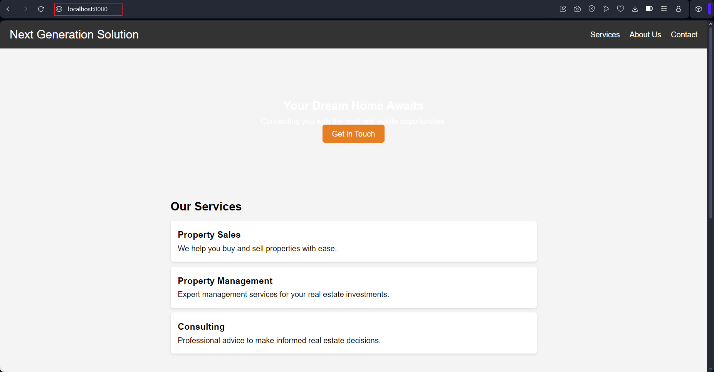

# Basic Frontend Application with Docker and Kubernetes

## Objective: 
To deploy a static website using Docker runtime through kubernetes cluster and access it through Nginx.

### Step 1: 
I created a new project directory and in and created the HTML file and CSS file named index.html and styles.css respectively.

I committed by initial code to Git repository.

### Step 2: 
I created a Dockerfile in the project directory specifying Nginx as the base image and within wrote a script to copy the index.html and styles.css file to the nginx/html file path. Script snippet as seen below.

"
#Use the official Nginx image from Docker Hub
FROM nginx:latest

#Copy HTML and CSS files to Nginx's default directory
COPY ./index.html /usr/share/nginx/html/index.html
COPY ./styles.css /usr/share/nginx/html/styles.css

#Expose port 80 to the outside world
EXPOSE 80

#Start Nginx when the container launches
CMD ["nginx", "-g", "daemon off;"] "

I created the nginx image with the Dockerfile.

### Step 3: 
I logged on to Docker with the command  "docker login -u my_username".

I pushed my docker image to Docker Hub with this command "docker pull my-username/my-repository"

### Step 4: 
I downloaded the binary file to kind (Kubernetes in Docker) and renamed the kind file to kind.exe and copied it to my system file path and added that file path to the system and so kind was installed.

I created a kind cluster with my desired name with this command "kind create cluster --name deployent1" and so a cluster was created.

### Step 5:
I created a Kubernetes Deployment YAML file specifying the image and desired replicas as seen below.

"
apiVersion: apps/v1  
kind: Deployment  
metadata:   
  name: my-nginx-deployment  
spec:  
  replicas: 2  
  selector:  
    matchLabels:  
      app: my-nginx  
  template:  
    metadata:  
      labels:  
        app: my-nginx  
    spec:  
      containers:  
      - name: my-nginx  
        image: tejirih/my-nginx-image:latest  # Ensure this matches your image name and tag  
        ports:  
        - containerPort: 80

"

I applied the deployment to my cluster with this command. 

"kubectl apply -f nginx-deployment.yaml
"
I checked if the pod is running with the "kubectl get pods" and it is running with the two replicas.

### Step 6:
Created a Kubernetes service YAML file specifying the type as clusterIP and applied the service to my cluster with this command "kubectl apply -f nginx-service.yaml

"
service script is below

apiVersion: v1  
kind: Service  
metadata:  
  name: my-nginx-clusterip-service  # Name of the service  
spec:  
  type: ClusterIP  # Service type: ClusterIP for internal access only  
  selector:  
    app: my-nginx  # Matches the label on your Deployment pods    
  ports:  
    - protocol: TCP  
      port: 80        # Port exposed by the service within the cluster  
      targetPort: 80  # Port the Nginx container listens on in the pod "

### Step 7:

I port-forward to the service to access the application locally with this command in a different tab

"kubectl port-forward service/my-nginx-clusterip-service 8080:80
"

This command forwards traffic from your local machine’s port 8080 to port 80 on the Kubernetes Service my-nginx-clusterip-service. 

I was able to access the site locally on my browser with this address "http://localhost:8080"

### Challenges:

I encountered several challenges in delivering this project which includes installing kind, i had copied the file to my program path but it wasn't working until i added specifically the path i was to the system path and then it was installed.
I had a challenge with my YAML deploymentt file, my nginx image name did not match the image name on my hub or on my local p.c and so i had to ensure there was a match with that and the tag, because the pod wasn't running.
And lastly my browser cache needed to be clear for me to run the url, it kept failing and serving me the default nginx page until i changed my browser and then it worked.

### Conclusion:

Project was concluded and objective achieved.